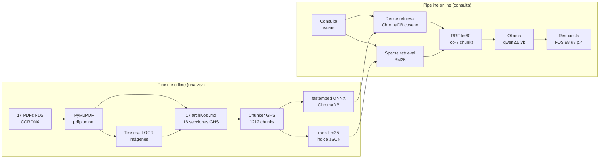

# RAG – Fichas de Datos de Seguridad CORONA

Sistema de Recuperación Aumentada por Generación (RAG) para consulta de Fichas de Datos de Seguridad (FDS) del fabricante CORONA. Permite hacer preguntas en lenguaje natural sobre 17 documentos FDS y recibir respuestas con citas de sección y página. Funciona completamente de forma local, sin APIs de pago ni conexión a internet.

**Parcial Final — Procesamiento de Lenguaje Natural**
**Universidad Sergio Arboleda**
**Alan Osorio · Santiago Díaz · Juan Camilo Gallardo**

---

## Arquitectura general



---

## Stack tecnológico

| Componente | Herramienta | Motivo |
|---|---|---|
| Extracción texto | PyMuPDF | Preserva jerarquía de fuentes (bold/size) |
| Extracción tablas | pdfplumber | Detección de celdas en PDF |
| OCR imágenes | Tesseract + Pillow | Trazabilidad de pictogramas GHS |
| Embeddings | fastembed ONNX | Sin PyTorch, ~241 MB, multilingüe |
| Vector store | ChromaDB (HNSW) | Persistente, SQLite, similitud coseno |
| Búsqueda léxica | rank-bm25 | Términos exactos: CAS, H-codes |
| Fusión | RRF (k=60) | Combina rankings sin problema de escala |
| LLM | Ollama qwen2.5:7b | Local, mejor español técnico, T=0.1 |

---

## Instalación

```bash
# 1. Clonar e instalar dependencias Python
pip install -r requirements.txt

# 2. Instalar Tesseract (OCR)
sudo apt install tesseract-ocr tesseract-ocr-spa

# 3. Instalar Ollama y descargar modelo
curl -fsSL https://ollama.ai/install.sh | sh
ollama pull qwen2.5:7b
```

---

## Uso

```bash
# Convertir PDFs a Markdown estructurado
python src/pipeline/run_pipeline.py \
    --input CORONA/ \
    --fabricante CORONA \
    --output output/markdown/

# Indexar chunks en ChromaDB + BM25
python src/rag/index.py --fabricante CORONA

# Consultar el sistema RAG (CLI interactivo)
python src/rag/query_cli.py --fabricante CORONA

# Evaluación cuantitativa (requiere Ollama activo)
python src/eval/metrics.py --fabricante CORONA --gt eval/ground_truth.json
```

---

## Estructura del repositorio

```
Parcial_Final_NLP/
│
├── README.md
├── requirements.txt
├── .gitignore
│
├── src/
│   ├── pipeline/               # PDF → Markdown (Santiago Díaz)
│   │   ├── parser.py           # Extracción texto con PyMuPDF
│   │   ├── sections.py         # Detección 16 secciones GHS
│   │   ├── tables.py           # Extracción tablas con pdfplumber
│   │   ├── ocr.py              # OCR imágenes + notas trazabilidad
│   │   ├── md_writer.py        # Ensamblaje final .md
│   │   └── run_pipeline.py     # Orquestador del pipeline
│   │
│   ├── rag/                    # Indexación y consulta (Alan Osorio)
│   │   ├── chunker.py          # Chunking por sección GHS
│   │   ├── embedder.py         # fastembed ONNX (384 dims)
│   │   ├── vectorstore.py      # ChromaDB persistente
│   │   ├── retriever.py        # Búsqueda híbrida BM25 + densa + RRF
│   │   ├── generator.py        # Generación con Ollama qwen2.5:7b
│   │   ├── index.py            # Indexación batch de chunks
│   │   └── query_cli.py        # Interfaz CLI
│   │
│   └── eval/                   # Evaluación (Juan Camilo Gallardo)
│       ├── metrics.py          # Similitud semántica, trazabilidad, cobertura
│       └── ground_truth.py     # Utilidades para cargar el GT
│
├── eval/
│   ├── ground_truth.json       # 35 pares Q-A (factual/técnica/multi_doc/trazab.)
│   ├── results.csv             # Resultados: trazabilidad 74.3%, cobertura 74.3%
│   └── sample_queries.txt      # 4 respuestas reales del RAG (Colab T4)
│
├── output/
│   └── markdown/               # 17 FDS CORONA convertidos a .md
│       └── FDS XX - *.md
│
├── notebooks/
│   ├── demo.ipynb              # Demo funcional con outputs
│   └── RAG_CORONA.ipynb        # Notebook de Colab con ejecución completa
│
├── docs/
│   ├── informe.md              # Informe técnico (decisiones, resultados, límites)
│   ├── pipeline.md             # Documentación del pipeline de extracción
│   ├── errores_extraccion.md   # 5 anomalías documentadas del OCR/extracción
│   ├── explicacion_sistema.md  # Guía completa del sistema para sustentación
│   ├── arquitectura/
│   │   ├── architecture.md     # Descripción de componentes
│   │   └── architecture.drawio # Diagrama editable (draw.io)
│   ├── documentos/
│   │   ├── Informe_Sistema_RAG_FDS_CORONA.pdf
│   │   └── Documentacion_Pipeline_Extraccion.pdf
│   ├── equipo/
│   │   ├── alan.md             # Contribución Alan Osorio
│   │   ├── santiago.md         # Contribución Santiago Díaz
│   │   └── juan.md             # Contribución Juan Camilo Gallardo
│   └── Indicaciones/
│       └── RAG_FDS.pdf         # Enunciado del parcial
│
└── data/                       # Generado localmente (no versionado)
    ├── chroma_db/              # Índice vectorial ChromaDB
    ├── chunks_corona.json      # Chunks serializados para BM25
    └── fastembed_cache/        # Modelo ONNX descargado
```

---

## Resultados de evaluación

Evaluación sobre 35 pares del ground truth (`eval/ground_truth.json`):

| Tipo | N | Trazabilidad sección | Cobertura documento |
|---|---|---|---|
| Factual | 12 | 75.0% | **100%** |
| Técnica | 9 | 77.8% | 88.9% |
| Multi-documento | 5 | **100%** | 40.0% |
| Trazabilidad | 9 | 55.6% | 44.4% |
| **GLOBAL** | **35** | **74.3%** | **74.3%** |

La similitud semántica coseno entre respuestas RAG y referencia se ejecutó en Google Colab T4. Ver `eval/sample_queries.txt` para 4 respuestas reales comparadas contra referencia.

---

## Estado del sistema

| Componente | Estado | Detalle |
|---|---|---|
| Pipeline PDF → MD | Completo | 17/17 FDS convertidos |
| Chunking GHS | Completo | 1212 chunks (767 texto + 445 tabla) |
| ChromaDB indexado | Listo | fastembed ONNX, similitud coseno, HNSW |
| Retriever híbrido | Operativo | BM25 + embeddings + RRF |
| LLM local | Requiere Ollama | `ollama pull qwen2.5:7b` (~4.7 GB) |
| Evaluación completa | Requiere GPU | ~2 min/pregunta en CPU sin GPU dedicada |

---

## División del trabajo

| Persona | Responsabilidad | Archivos clave |
|---|---|---|
| **Santiago Díaz** | Pipeline PDF → Markdown, detección secciones GHS, tablas | `src/pipeline/` |
| **Alan Osorio** | OCR y trazabilidad, sistema RAG completo, indexación | `src/pipeline/ocr.py`, `src/rag/` |
| **Juan Camilo Gallardo** | Ground truth, evaluación cuantitativa, demo notebook | `src/eval/`, `notebooks/`, `eval/` |
