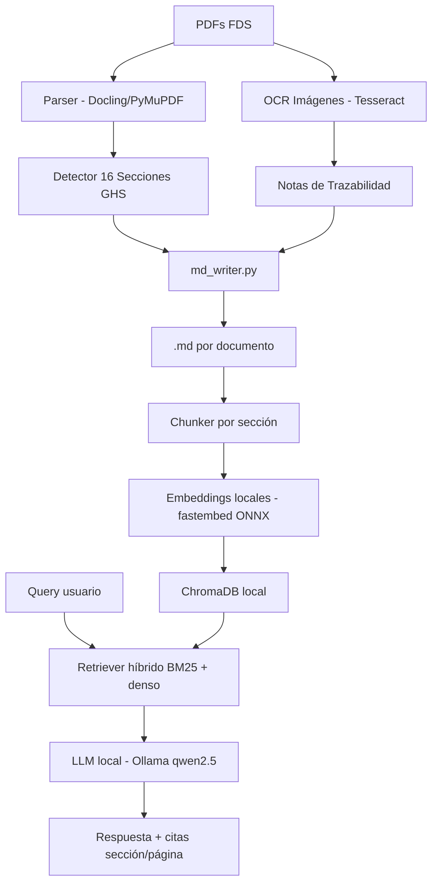

# RAG – Fichas de Datos de Seguridad

Sistema RAG (Recuperación Aumentada por Generación) para consulta de Fichas de Datos de Seguridad (FDS) de fabricantes de pinturas.  
Parcial Final – NLP – Semestre 8.

## Fabricante asignado

**CORONA** — 17 documentos FDS indexados (1212 chunks)

## Arquitectura



## Instalación

```bash
# 1. Clonar e instalar dependencias
pip install -r requirements.txt

# 2. Instalar Tesseract (OCR)
sudo apt install tesseract-ocr tesseract-ocr-spa

# 3. Instalar Ollama y modelo LLM
curl -fsSL https://ollama.ai/install.sh | sh
ollama pull qwen2.5:7b
```

## Uso

```bash
# Convertir PDFs a Markdown
python src/pipeline/run_pipeline.py --input data/ --output output/markdown/

# Indexar documentos en ChromaDB
python src/rag/index.py

# Consultar el sistema RAG
python src/rag/query_cli.py

# Correr evaluación vs. ground truth
python src/eval/metrics.py
```

## Estructura del proyecto

```
Parcial_Final_NLP/
├── README.md
├── .gitignore
├── src/
│   ├── pipeline/        # PDF → MD (Santiago)
│   │   ├── parser.py
│   │   ├── sections.py
│   │   ├── tables.py
│   │   ├── ocr.py        # (Alan)
│   │   └── md_writer.py
│   ├── rag/             # Indexación + consulta (Alan)
│   │   ├── chunker.py
│   │   ├── embedder.py
│   │   ├── vectorstore.py
│   │   ├── retriever.py
│   │   ├── generator.py
│   │   └── query_cli.py
│   └── eval/            # Evaluación (Juan)
│       ├── ground_truth.py
│       └── metrics.py
├── data/                # PDFs originales (no versionado)
├── output/
│   ├── markdown/        # .md generados
│   │   └── images/          # imágenes extraídas (no versionado)
├── notebooks/
│   └── demo.ipynb       # Demo funcional (Juan)
├── docs/
│   ├── alan.md          # Asignación Alan
│   ├── santiago.md      # Asignación Santiago
│   ├── juan.md          # Asignación Juan
│   ├── pipeline.md
│   ├── architecture.md
│   ├── informe.md
│   └── errores_extraccion.md
└── eval/
    ├── ground_truth.json
    └── results.csv
```

## Ejemplo de documento convertido a Markdown

El pipeline convierte cada PDF FDS a un `.md` estructurado con las 16 secciones GHS, tablas y notas de trazabilidad OCR. Ejemplo de extracto de [`output/markdown/FDS 94 - ESMALTE METAL MASTER PREMIUM - CORONA.md`](output/markdown/FDS%2094%20-%20ESMALTE%20METAL%20MASTER%20PREMIUM%20-%20CORONA.md):

```markdown
## SECCIÓN 2: Identificación de peligros

Liq. Infl. 3: Líquidos inflamables, Categoría 3, H226
Carc. 1B: Carcinogenicidad, Categoría 1B, H350
Muta. 1B: Mutagenicidad en células germinales, Categoría 1B, H340

## SECCIÓN 9: Propiedades físicas y químicas

| Propiedad | Valor |
|-----------|-------|
| Estado físico | Líquido |
| Punto de inflamación | 60 ºC |
| Temperatura de auto-inflamación | 200 ºC |
| Densidad a 20 ºC | (ver ficha técnica) |


> *Nota de trazabilidad: La información asociada a esta figura se encuentra
> en la Sección 9: PROPIEDADES FÍSICAS Y QUÍMICAS Y CARACTERÍSTICAS DE SEGURIDAD.*
```

Los 17 archivos `.md` generados están en [`output/markdown/`](output/markdown/).

## Estado del sistema

| Componente | Estado | Detalle |
|---|---|---|
| Pipeline PDF→MD | ✅ Completo | 17/17 FDS, 626 imágenes OCR |
| Chunking | ✅ Completo | 1212 chunks (767 texto + 445 tabla) |
| Embeddings + ChromaDB | ✅ Indexado | paraphrase-multilingual-MiniLM-L12-v2 |
| Retriever híbrido | ✅ Operativo | BM25 + coseno + RRF |
| LLM (Ollama qwen2.5:7b) | ⚠️ Requiere instalación | `ollama pull qwen2.5:7b` |
| Evaluación (35 pares) | ⚠️ Requiere Ollama | `python src/eval/metrics.py` |

## División del trabajo

| Persona | Responsabilidad | Archivos clave |
|---------|----------------|---------------|
| **Santiago** | Pipeline PDF→MD, 16 secciones, tablas | `src/pipeline/` |
| **Alan** | OCR imágenes, trazabilidad, RAG core | `src/pipeline/ocr.py`, `src/rag/` |
| **Juan** | Ground truth, evaluación, docs, demo | `src/eval/`, `docs/`, `notebooks/` |

Ver asignación detallada en `docs/alan.md`, `docs/santiago.md`, `docs/juan.md`.

## Equipo

- Alan Osorio
- Santiago
- Juan
