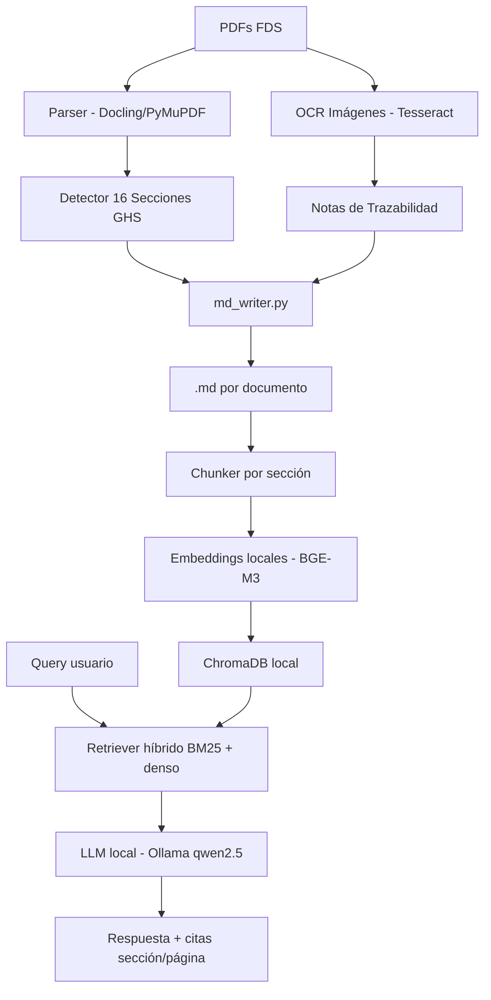

# RAG – Fichas de Datos de Seguridad

Sistema RAG (Recuperación Aumentada por Generación) para consulta de Fichas de Datos de Seguridad (FDS) de fabricantes de pinturas.  
Parcial Final – NLP – Semestre 8.

## Fabricante asignado

> **⚠️ Confirmar grupo en Moodle** y actualizar esta línea con el fabricante correspondiente.

## Arquitectura



## Instalación

```bash
# 1. Clonar e instalar dependencias
pip install -r requirements.txt

# 2. Instalar Tesseract (OCR)
sudo apt install tesseract-ocr tesseract-ocr-spa

# 3. Instalar Ollama y modelo LLM
curl -fsSL https://ollama.ai/install.sh | sh
ollama pull qwen2.5:7b
```

## Uso

```bash
# Convertir PDFs a Markdown
python src/pipeline/run_pipeline.py --input data/ --output output/markdown/

# Indexar documentos en ChromaDB
python src/rag/index.py

# Consultar el sistema RAG
python src/rag/query_cli.py

# Correr evaluación vs. ground truth
python src/eval/metrics.py
```

## Estructura del proyecto

```
Parcial_Final_NLP/
├── README.md
├── .gitignore
├── src/
│   ├── pipeline/        # PDF → MD (Santiago)
│   │   ├── parser.py
│   │   ├── sections.py
│   │   ├── tables.py
│   │   ├── ocr.py        # (Alan)
│   │   └── md_writer.py
│   ├── rag/             # Indexación + consulta (Alan)
│   │   ├── chunker.py
│   │   ├── embedder.py
│   │   ├── vectorstore.py
│   │   ├── retriever.py
│   │   ├── generator.py
│   │   └── query_cli.py
│   └── eval/            # Evaluación (Juan)
│       ├── ground_truth.py
│       └── metrics.py
├── data/                # PDFs originales (no versionado)
├── output/
│   ├── markdown/        # .md generados
│   └/images/            # imágenes extraídas
├── notebooks/
│   └── demo.ipynb       # Demo funcional (Juan)
├── docs/
│   ├── alan.md          # Asignación Alan
│   ├── santiago.md      # Asignación Santiago
│   ├── juan.md          # Asignación Juan
│   ├── pipeline.md
│   ├── architecture.md
│   ├── informe.md
│   └── errores_extraccion.md
└── eval/
    ├── ground_truth.json
    └── results.csv
```

## División del trabajo

| Persona | Responsabilidad | Archivos clave |
|---------|----------------|---------------|
| **Santiago** | Pipeline PDF→MD, 16 secciones, tablas | `src/pipeline/` |
| **Alan** | OCR imágenes, trazabilidad, RAG core | `src/pipeline/ocr.py`, `src/rag/` |
| **Juan** | Ground truth, evaluación, docs, demo | `src/eval/`, `docs/`, `notebooks/` |

Ver asignación detallada en `docs/alan.md`, `docs/santiago.md`, `docs/juan.md`.

## Equipo

- Alan Osorio
- Santiago
- Juan
