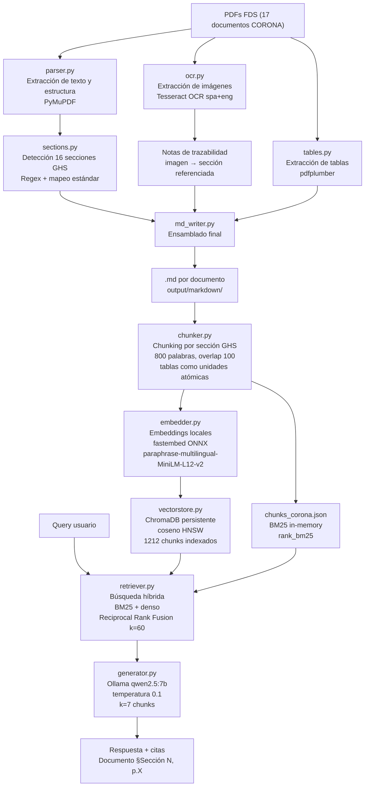

# Arquitectura del Sistema RAG – FDS CORONA

## Diagrama de flujo

## Descripción de componentes

### Pipeline PDF → Markdown

| Módulo | Herramienta | Función |
|--------|-------------|---------|
| `parser.py` | PyMuPDF (fitz) | Extrae bloques de texto, clasifica heading/párrafo/lista según tamaño de fuente |
| `sections.py` | Regex | Detecta las 16 secciones GHS estándar en español, mapea a títulos normalizados |
| `tables.py` | pdfplumber | Extrae tablas y las convierte a formato Markdown |
| `ocr.py` | Tesseract OCR | Procesa imágenes incrustadas, genera notas de trazabilidad imagen→sección |
| `md_writer.py` | — | Ensambla el .md final combinando bloques, tablas y notas OCR |

### Pipeline RAG

| Módulo | Herramienta | Función |
|--------|-------------|---------|
| `chunker.py` | — | Segmenta .md por `## SECCIÓN N:`, máx. 800 palabras, overlap 100, tablas atómicas |
| `embedder.py` | fastembed (ONNX) | Genera embeddings L2-normalizados sin PyTorch |
| `vectorstore.py` | ChromaDB | Índice HNSW persistente con similitud coseno |
| `retriever.py` | rank_bm25 | Búsqueda híbrida con RRF; BM25 en memoria desde JSON |
| `generator.py` | Ollama qwen2.5:7b | LLM local con prompt de citas, temperatura 0.1 |

## Decisiones de diseño

- **fastembed en lugar de sentence-transformers**: evita PyTorch (~2 GB), usa ONNX (~241 MB). Compatible con el modelo multilingüe elegido.
- **ChromaDB local**: persistencia en SQLite + HNSW, sin servidor externo requerido.
- **Chunking por sección GHS**: los 16 encabezados estandarizados de la normativa son límites semánticos naturales. Un chunk que cruza secciones mezclaría información de seguridad incompatible.
- **BM25 + denso (RRF)**: BM25 captura términos exactos (CAS, códigos H, números de sección); los embeddings densos capturan semántica. RRF normaliza los rankings sin necesidad de ajustar pesos.
- **qwen2.5:7b con Ollama**: modelo multilingüe local de calidad que funciona bien en español técnico, cero costo de API.
