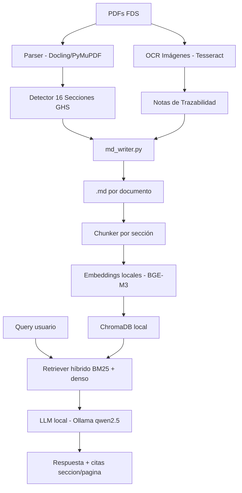

# Asignación: Juan — Evaluación, Documentación y Demo
> **Rol:** Evaluación del RAG + Documentación técnica + Demo final  
> **Carga estimada:** ~30% del proyecto  
> **Criterios de nota cubiertos:** Documentación técnica y presentación (20%) + parte de Implementación RAG/eval (10%) + soporte en arquitectura (20%) = **~30% directo**

---

## Objetivo general

Juan tiene tres responsabilidades que corren en paralelo con los demás:
1. **Ground truth y evaluación**: Construir el dataset de preguntas-respuestas de referencia y correr las métricas sobre el RAG de Alan.
2. **Documentación técnica**: README, diagramas de arquitectura, documentación del pipeline.
3. **Demo e informe final**: Notebook de demostración y reporte escrito.

> **Ventaja:** Puedes avanzar en ground truth e informe desde el Día 1, sin esperar a Santiago ni Alan. Solo para las métricas necesitas esperar el RAG.

---

## Módulo 1: Ground Truth — `eval/ground_truth.json`

### Qué hacer

Construir un conjunto de ~30–40 pares **pregunta–respuesta de referencia** derivados directamente de los PDFs originales del fabricante asignado.

### Herramienta recomendada: NotebookLM

1. Ir a [notebooklm.google.com](https://notebooklm.google.com).
2. Subir 2–3 PDFs del fabricante asignado.
3. Pedirle que genere preguntas sobre el documento — puedes guiar el tipo:
   - **Factuales**: "¿Cuál es el punto de inflamación de este producto?"
   - **Técnicas**: "¿Qué EPP se recomienda para manipular este producto?"
   - **Trazabilidad**: "¿En qué sección y página se especifican los límites de exposición?"
   - **Multi-sección**: "¿Cómo se relacionan las medidas de almacenamiento con las propiedades físicas?"
4. Verificar que la respuesta sea correcta consultando el PDF directamente.

### Estructura del JSON

```json
[
  {
    "id": "q001",
    "pregunta": "¿Cuál es el punto de inflamación de la Pintura Primera Mano CORONA?",
    "respuesta_referencia": "El punto de inflamación es >60°C según el método ASTM D93.",
    "seccion_fuente": "Sección 9 – Propiedades físicas y químicas",
    "pagina_fuente": 4,
    "documento": "FDS 29 - PINTURA PRIMERA MANO & ACABADO - CORONA.pdf",
    "tipo": "factual"
  },
  {
    "id": "q002",
    "pregunta": "¿Qué medidas de protección personal se deben usar al manipular este producto?",
    "respuesta_referencia": "Usar guantes de nitrilo, gafas de seguridad y respirador con filtro para vapores orgánicos.",
    "seccion_fuente": "Sección 8 – Controles de exposición / protección personal",
    "pagina_fuente": 3,
    "documento": "FDS 29 - PINTURA PRIMERA MANO & ACABADO - CORONA.pdf",
    "tipo": "tecnica"
  }
]
```

### Distribución de los ~35 pares recomendada

| Tipo | Cantidad | Ejemplo |
|------|----------|---------|
| Factual simple | 12 | Punto de ebullición, pH, densidad |
| Técnica | 10 | EPP, almacenamiento, extinción de incendios |
| Trazabilidad | 8 | "¿En qué sección está X?" |
| Multi-documento | 5 | Comparar dos productos del fabricante |

---

## Módulo 2: Evaluación del RAG — `src/eval/metrics.py`

### Qué hace

Toma el `ground_truth.json` y corre el sistema RAG de Alan sobre cada pregunta, luego compara respuesta generada vs. respuesta de referencia con varias métricas.

### Pasos

1. Instalar `ragas` y dependencias:
   ```bash
   pip install ragas sentence-transformers pandas
   ```

2. Crear script `src/eval/metrics.py`:

```python
import json
import pandas as pd
from sentence_transformers import SentenceTransformer, util

# Cargar ground truth
with open("eval/ground_truth.json") as f:
    ground_truth = json.load(f)

model = SentenceTransformer("paraphrase-multilingual-MiniLM-L12-v2")

results = []
for item in ground_truth:
    # 1. Llamar al RAG de Alan
    rag_answer, sources = rag_chain(item["pregunta"])  # importar de src/rag
    
    # 2. Exactitud semántica (cosine similarity)
    emb_ref = model.encode(item["respuesta_referencia"])
    emb_gen = model.encode(rag_answer)
    semantic_score = float(util.cos_sim(emb_ref, emb_gen))
    
    # 3. Trazabilidad: ¿citó la sección correcta?
    correct_section = item["seccion_fuente"].split("–")[0].strip()
    traceability_ok = any(correct_section in str(s) for s in sources)
    
    results.append({
        "id": item["id"],
        "pregunta": item["pregunta"],
        "respuesta_referencia": item["respuesta_referencia"],
        "respuesta_rag": rag_answer,
        "similaridad_semantica": round(semantic_score, 3),
        "trazabilidad_correcta": traceability_ok,
        "tipo": item["tipo"]
    })

df = pd.DataFrame(results)
df.to_csv("eval/results.csv", index=False)
print(df[["similaridad_semantica", "trazabilidad_correcta"]].describe())
```

3. Analizar resultados y documentar en el informe:
   - Similitud semántica promedio por tipo de pregunta.
   - % de preguntas donde se recuperó la sección correcta.
   - Ejemplos de alucinaciones o errores notables.
   - Comparativo tabla: respuesta esperada vs. respuesta RAG.

---

## Módulo 3: Documentación técnica

### 3a. `docs/architecture.md` — Diagrama de arquitectura

Crear un diagrama con **Mermaid** (se renderiza en GitHub) que muestre el flujo completo del sistema.

```markdown

```

### 3b. `docs/pipeline.md` — Documentación del pipeline

Documento de ~1–2 páginas describiendo:
1. Herramientas elegidas y por qué (Docling vs alternativas).
2. Cómo se preservan las 16 secciones.
3. Tratamiento de tablas.
4. Tratamiento de imágenes y OCR.
5. Limitaciones conocidas (sacar de `docs/errores_extraccion.md` de Santiago).

---

## Módulo 4: `README.md` del repositorio

El README principal debe tener:

```markdown
# RAG – Fichas de Datos de Seguridad | [Fabricante]

## Descripción
Sistema RAG para consulta de Fichas de Datos de Seguridad del fabricante X.

## Arquitectura
[diagrama mermaid]

## Instalación
```bash
pip install -r requirements.txt
ollama pull qwen2.5:7b
```

## Uso
```bash
# 1. Convertir PDFs a Markdown
python src/pipeline/run_pipeline.py --input data/ --output output/markdown/

# 2. Indexar documentos
python src/rag/index.py

# 3. Consultar
python src/rag/query_cli.py
```

## Estructura del proyecto
[árbol de carpetas]

## Resultados de evaluación
[tabla resumen de métricas]
```

---

## Módulo 5: Informe final — `docs/informe.md`

Documento de ~3–5 páginas con las siguientes secciones:

1. **Introducción**: Qué se construyó y para qué.
2. **Decisiones técnicas**: Por qué Docling, por qué BGE-M3, por qué ChromaDB, por qué qwen2.5. Justificar cada elección en términos de costo-beneficio.
3. **Estrategia de chunking**: Explicar el chunking por sección GHS y por qué es la mejor opción para FDS.
4. **Trazabilidad**: Cómo se implementó de extremo a extremo (imagen → sección, chunk → metadatos, respuesta → cita).
5. **Resultados de evaluación**: Tabla comparativa con métricas, 3–5 ejemplos concretos de pregunta/respuesta esperada/respuesta generada.
6. **Limitaciones**: Qué no funciona bien, qué se podría mejorar.
7. **Conclusiones**.

---

## Módulo 6: `notebooks/demo.ipynb` — Notebook de demostración

Notebook ejecutable que muestre el flujo completo:

1. Cargar un PDF y mostrarlo.
2. Mostrar el `.md` generado (con tablas e imágenes).
3. Hacer 3–5 consultas al RAG.
4. Mostrar respuesta + fuentes recuperadas.
5. Mostrar métricas de evaluación con tabla.

---

## Orden de ejecución sugerido

```
Día 1: Empezar ground truth en NotebookLM (no necesitas código todavía)
Día 2: Terminar ground_truth.json, empezar architecture.md y README
Día 3: Esperar .md de Santiago → revisar calidad, completar pipeline.md
Día 4: Cuando RAG de Alan esté listo → correr metrics.py
Día 5: Analizar resultados, completar informe.md, pulir demo notebook
```

---

## Checklist de entrega

- [ ] `eval/ground_truth.json` con ~35 pares Q-A (factuales, técnicas, trazabilidad)
- [ ] `src/eval/metrics.py` funcional
- [ ] `eval/results.csv` con métricas calculadas
- [ ] `docs/architecture.md` con diagrama Mermaid
- [ ] `docs/pipeline.md` documentado
- [ ] `README.md` completo con instrucciones de uso
- [ ] `docs/informe.md` (~3–5 páginas) con comparativo de resultados
- [ ] `notebooks/demo.ipynb` ejecutable de punta a punta

---

## Dependencias

```bash
pip install ragas sentence-transformers pandas jupyter notebook
```

> **Nota:** Juan no necesita instalar Ollama ni Tesseract — solo las librerías de evaluación y documentación. Coordinar con Alan para importar `rag_chain` en `metrics.py`.
